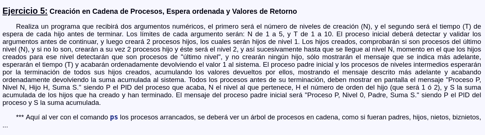

# Sistemas_Operativos_II
## Sesión 3, Procesos: Identificación, Clonación, Ejecución, Terminación y Espera.

#### Espero que no lo copiéis tal cual, Intentarlo primero y luego una segunda y tercera vez, y en la cuarta a lo mejor podríais venir a echarle un vistazo, pero nunca copiarlo desde el principio.

################### Fotos de los Ejercicios ##################

